## 1. Visão Geral do Produto

O Purpose Food é um sistema completo de gerenciamento para empresas de salgados e doces artesanais, desenvolvido para otimizar a gestão de produtos, pedidos, clientes e finanças. O sistema visa resolver problemas de controle de estoque, gestão de pedidos, acompanhamento financeiro e relacionamento com clientes, permitindo que pequenos e médios produtores artesanais tenham controle total sobre seus negócios de forma simplificada e eficiente.

O produto é direcionado para produtores artesanais de salgados e doces que buscam profissionalizar a gestão de seus negócios, aumentar a eficiência operacional e melhorar o atendimento ao cliente. O sistema oferece uma plataforma integrada que conecta todas as áreas do negócio em uma única interface intuitiva.

## 2. Funcionalidades Principais

### 2.1 Papéis de Usuário

| Papel | Método de Registro | Permissões Principais |
|-------|-------------------|----------------------|
| Administrador | Registro via email convite | Acesso completo a todos os módulos e configurações |
| Operador | Cadastro pelo administrador | Acesso a pedidos, produtos e clientes (sem relatórios financeiros) |
| Visualizador | Cadastro pelo administrador | Apenas visualização de dashboard e produtos |

### 2.2 Módulos do Sistema

O sistema Purpose Food consiste nos seguintes módulos principais:

1. **Dashboard**: Visão geral do negócio com métricas em tempo real, pedidos recentes, alertas de estoque e ações rápidas.

2. **Produtos**: Gestão completa de produtos artesanais com controle de estoque, categorias, preços e margem de lucro.

3. **Pedidos**: Sistema de gestão de pedidos com visualização em formato Kanban, controle de status, tipos de entrega e retirada.

4. **Clientes**: Cadastro e gestão de clientes com perfil completo, histórico de pedidos e anotações especiais.

5. **Financeiro**: Controle financeiro completo com receitas, despesas, lucro líquido, metas mensais e gráficos de performance.

6. **Relatórios**: Geração de relatórios detalhados com exportação em PDF/Excel e análises de desempenho.

7. **Vendas**: Interface de vendas com integração a gateways de pagamento e emissão de recibos.

8. **Redes Sociais**: Integração completa com Instagram, Facebook e WhatsApp Business para postagem automática, recebimento de pedidos e atendimento ao cliente.

9. **Nota Fiscal**: Emissão de notas fiscais eletrônicas (NF-e) para clientes PJ com integração ao sistema da Sefaz.

### 2.3 Detalhamento de Funcionalidades por Módulo

| Módulo | Funcionalidade | Descrição |
|--------|---------------|-----------|
| Dashboard | Métricas em tempo real | Exibir total de vendas do dia, pedidos pendentes, clientes ativos e estoque baixo com atualização automática |
| Dashboard | Pedidos recentes | Listar os 10 últimos pedidos com status, cliente e valor total para acompanhamento rápido |
| Dashboard | Alertas de estoque | Notificar produtos com estoque abaixo do mínimo configurado com indicação visual colorida |
| Dashboard | Ações rápidas | Botões diretos para criar novo pedido, cadastrar cliente e adicionar produto |
| Produtos | CRUD de produtos | Criar, editar, visualizar e excluir produtos com nome, descrição, categoria, preço de custo e venda |
| Produtos | Controle de estoque | Gerenciar quantidades em estoque, definir estoque mínimo, registrar entradas e saídas com histórico |
| Produtos | Categorias | Organizar produtos em categorias personalizadas (salgados, doces, especiais, etc.) |
| Produtos | Margem de lucro | Calcular automaticamente margem de lucro baseada no preço de custo e venda com indicador visual |
| Produtos | Imagens | Adicionar até 5 imagens por produto com visualização em galeria e zoom |
| Pedidos | Kanban de status | Visualizar pedidos em colunas por status (novo, preparação, pronto, entregue) com drag and drop |
| Pedidos | Gestão de entrega | Registrar tipo de entrega (delivery/retirada), endereço, taxa de entrega e previsão de horário |
| Pedidos | Itens do pedido | Adicionar múltiplos produtos com quantidades, preços unitários e observações por item |
| Pedidos | Status automatizado | Atualizar status automaticamente baseado em regras de tempo e preparação |
| Clientes | Perfil completo | Cadastrar nome, telefone, email, endereço, data de aniversário e preferências |
| Clientes | Histórico de pedidos | Visualizar todos os pedidos do cliente com filtros por período e status |
| Clientes | Anotações | Adicionar anotações especiais sobre preferências, restrições alimentares e observações |
| Clientes | Classificação | Classificar clientes por frequência de compras e valor gasto para fidelização |
| Clientes | Cadastro PJ | Cadastrar clientes pessoa jurídica com CNPJ, razão social, inscrição estadual e dados fiscais |
| Financeiro | Controle de receitas | Registrar todas as vendas com detalhamento por produto, forma de pagamento e data |
| Financeiro | Controle de despesas | Cadastrar despesas operacionais com categorias (insumos, embalagens, delivery, etc.) |
| Financeiro | Lucro líquido | Calcular lucro líquido mensal considerando receitas menos despesas e custos dos produtos |
| Financeiro | Metas mensais | Definir metas de vendas e acompanhar percentual de cumprimento com gráfico de progresso |
| Financeiro | Fluxo de caixa | Visualizar entradas e saídas diárias com saldo acumulado e projeções futuras |
| Relatórios | Vendas por período | Gerar relatório de vendas com filtros por data, produto e cliente com gráficos de tendência |
| Relatórios | Produtos mais vendidos | Listar top 10 produtos com quantidade vendida, faturamento e margem de lucro |
| Relatórios | Análise de clientes | Relatório de clientes ativos, recorrência de compras e ticket médio |
| Relatórios | Exportação | Exportar relatórios em PDF para impressão e Excel para análise em planilhas |
| Relatórios | Relatórios fiscais | Gerar relatórios mensais de notas fiscais emitidas, alíquotas e impostos pagos |
| Vendas | Interface de vendas | Tela otimizada para registro rápido de vendas com busca de produtos e calculadora de troco |
| Vendas | Integração pagamento | Integração com gateway de pagamento (Mercado Pago/PagSeguro) para pagamento online e cartão |
| Vendas | Emissão de recibos | Gerar recibos em PDF para clientes com QR code para pagamento e informações da empresa |
| Vendas | Vendas por WhatsApp | Integração com WhatsApp para envio de catálogo e confirmação de pedidos automaticamente |
| Redes Sociais | Postagem automática | Publicar produtos automaticamente no Instagram e Facebook com imagens e descrições |
| Redes Sociais | Pedidos via DM | Receber e processar pedidos enviados por mensagens diretas do Instagram/Facebook |
| Redes Sociais | WhatsApp Business | Integração com catálogo do WhatsApp Business para exibir produtos e receber pedidos |
| Redes Sociais | Agendamento de posts | Agendar postagens promocionais para datas específicas com antecedência |
| Redes Sociais | Resposta automática | Configurar respostas automáticas para clientes com informações de horário, cardápio e preços |
| Redes Sociais | Métricas sociais | Acompanhar engajamento, alcance e conversão de posts promocionais |
| Nota Fiscal | Emissão NF-e | Emitir notas fiscais eletrônicas para clientes pessoa jurídica com todos os dados necessários |
| Nota Fiscal | Integração Sefaz | Integração direta com sistema da Sefaz para validação e envio de notas fiscais |
| Nota Fiscal | Cadastro de clientes PJ | Gerenciar cadastro completo de clientes jurídicos com CNPJ, endereço fiscal e dados de contato |
| Nota Fiscal | Configuração fiscal | Configurar alíquotas de ICMS, IPI, PIS/COFINS e outros impostos por produto |
| Nota Fiscal | Armazenamento de notas | Manter histórico completo de notas emitidas com PDF e XML para download |
| Nota Fiscal | Relatórios fiscais | Gerar relatórios mensais de notas emitidas, impostos pagos e débitos fiscais |
| Nota Fiscal | Cancelamento de notas | Realizar cancelamento de notas fiscais dentro do prazo legal estabelecido |

## 3. Fluxos de Operação Principais

### 3.1 Fluxo de Pedido Completo

O processo de pedido segue a seguinte sequência:

1. Cliente faz pedido via WhatsApp/telefone ou presencialmente
2. Operador acessa módulo de Pedidos e clica em "Novo Pedido"
3. Seleciona cliente existente ou cadastra novo cliente
4. Adiciona produtos ao pedido com quantidades e observações
5. Define tipo de entrega (delivery/retirada) e endereço
6. Calcula valor total incluindo taxa de entrega se aplicável
7. Confirma pedido e sistema gera número único
8. Pedido aparece no Kanban para acompanhamento da preparação
9. Status é atualizado conforme progresso (novo → preparação → pronto → entregue)
10. Sistema registra venda no financeiro automaticamente

### 3.2 Fluxo de Gestão de Estoque

Para manter estoque sempre atualizado:

1. Administrador define estoque mínimo para cada produto
2. Sistema monitora níveis de estoque diariamente
3. Quando estoque fica abaixo do mínimo, gera alerta no dashboard
4. Administrador acessa módulo de Produtos e clica em "Atualizar Estoque"
5. Registra entrada de novos produtos com quantidade e custo
6. Sistema atualiza quantidade disponível automaticamente
7. Cada venda gera saída de estoque correspondente
8. Histórico de movimentações fica disponível para auditoria

### 3.3 Fluxo de Acompanhamento Financeiro

Para controle financeiro efetivo:

1. Sistema registra automaticamente receitas das vendas realizadas
2. Administrador cadastra despesas operacionais diariamente
3. Sistema calcula lucro bruto (vendas - custo dos produtos vendidos)
4. Sistema calcula lucro líquido (lucro bruto - despesas operacionais)
5. Dashboard exibe métricas atualizadas em tempo real
6. Administrador pode definir metas mensais de vendas
7. Sistema calcula percentual de cumprimento das metas
8. Relatórios mensais são gerados automaticamente para análise

### 3.4 Fluxo de Integração com Redes Sociais

Para postagem automática e gestão social:

1. Administrador configura contas do Instagram e Facebook no sistema
2. Sistema solicita permissões de postagem via API oficial
3. Administrador cria produto no sistema com imagens e descrição
4. Sistema oferece opção de "Publicar nas Redes Sociais" automaticamente
5. Postagem é agendada ou publicada imediatamente com hashtag automática
6. Clientes interagem via comentários ou mensagens diretas
7. Sistema captura pedidos via DM e converte em pedidos do sistema
8. Respostas automáticas são enviadas com informações básicas
9. Métricas de engajamento são coletadas e exibidas no dashboard

### 3.5 Fluxo de Emissão de Nota Fiscal

Para emissão de NF-e de clientes PJ:

1. Cliente PJ é cadastrado com CNPJ, razão social e endereço fiscal
2. Produtos são configurados com alíquotas fiscais apropriadas
3. No momento da venda, sistema identifica cliente como PJ
4. Administrador seleciona opção "Emitir Nota Fiscal" no pedido
5. Sistema prepara dados da NF-e com base no pedido e cliente
6. Integração com Sefaz valida e transmite a nota fiscal
7. NF-e é emitida com número e chave de acesso únicos
8. PDF e XML são armazenados no sistema para download
9. Relatórios fiscais são atualizados automaticamente

### 3.6 Diagrama de Navegação

```mermaid
graph TD
    A[Login] --> B[Dashboard]
    B --> C[Produtos]
    B --> D[Pedidos]
    B --> E[Clientes]
    B --> F[Financeiro]
    B --> G[Relatórios]
    B --> H[Vendas]
    B --> I[Redes Sociais]
    B --> J[Nota Fiscal]
    
    C --> C1[Listar Produtos]
    C --> C2[Cadastrar Produto]
    C --> C3[Editar Produto]
    
    D --> D1[Kanban de Pedidos]
    D --> D2[Novo Pedido]
    D --> D3[Detalhes do Pedido]
    
    E --> E1[Listar Clientes]
    E --> E2[Cadastrar Cliente]
    E --> E3[Perfil do Cliente]
    
    F --> F1[Dashboard Financeiro]
    F --> F2[Lançar Despesas]
    F --> F3[Definir Metas]
    
    G --> G1[Vendas por Período]
    G --> G2[Produtos Mais Vendidos]
    G --> G3[Análise de Clientes]
    G --> G4[Relatórios Fiscais]
    
    H --> H1[Interface de Vendas]
    H --> H2[Configurar Pagamento]
    
    I --> I1[Gerenciar Contas]
    I --> I2[Postagem Automática]
    I --> I3[Agendamento de Posts]
    I --> I4[Métricas Sociais]
    
    J --> J1[Emitir NF-e]
    J --> J2[Clientes PJ]
    J --> J3[Configurações Fiscais]
    J --> J4[Notas Emitidas]
```

## 4. Design de Interface e Experiência do Usuário

### 4.1 Estilo de Design

O design do sistema Purpose Food segue uma abordagem moderna e limpa, priorizando a usabilidade e clareza das informações:

- **Cores principais**: Fundo creme (#F5F3F0) para áreas de fundo, criando ambiente aconchehante
- **Cards e containers**: Branco puro (#FFFFFF) com sombras suaves para destacar seções
- **Cor positiva/valores**: Verde (#4CAF50) para indicar lucros, vendas positivas e status de sucesso
- **Cor de ação**: Laranja (#FF6B35) para botões principais e chamadas para ação
- **Cor informativa**: Azul (#2196F3) para informações, links e elementos de navegação
- **Tipografia**: Fonte sans-serif moderna (Inter/Roboto) com hierarquia clara de tamanhos
- **Botões**: Estilo arredondado com hover effects suaves para melhor feedback visual
- **Layout**: Card-based design com espaçamento generoso para melhor legibilidade
- **Ícones**: Estilo outline minimalista com consistência visual em todo o sistema

### 4.2 Estrutura de Layout

O sistema utiliza layout de duas colunas fixas:

- **Sidebar esquerda** (280px): Navegação principal com logo, menu de módulos e informações do usuário
- **Conteúdo principal** (flexível): Área de trabalho dinâmica que se adapta ao módulo selecionado
- **Header superior**: Barra de notificações, busca global e acesso rápido ao perfil
- **Footer**: Informações de versão e links de suporte

### 4.3 Responsividade e Adaptação

O sistema é desenvolvido com abordagem desktop-first, considerando que a maioria das operações será realizada em computadores ou tablets:

- **Desktop** (1200px+): Layout completo com sidebar expandida e todas funcionalidades
- **Tablet** (768px-1199px): Sidebar retrátil e cards adaptativos para melhor aproveitamento de espaço
- **Mobile** (até 767px): Menu hamburger e interface otimizada para telas pequenas, focando em funcionalidades essenciais como consulta de pedidos e cadastro rápido

Touch interaction é otimizada para tablets utilizados na cozinha ou para delivery, com botões grandes e fácil navegação por gestos.

### 4.4 Componentes de Interface

| Componente | Descrição do Design |
|-----------|-------------------|
| Cards de métricas | Fundo branco com borda sutil, ícone colorido no topo, número grande em negrito e label pequena em cinza |
| Tabelas de dados | Zebradas com hover, ordenação por colunas, paginação no rodapé e busca instantânea |
| Formulários | Campos com labels flutuantes, validação em tempo real e feedback visual de sucesso/erro |
| Botões de ação | Primário (laranja), secundário (cinza), sucesso (verde) e perigo (vermelho) com consistência em todo sistema |
| Modais | Overlay escuro com card centralizado, título claro e botões de ação alinhados à direita |
| Notificações | Toast notifications no canto superior direito com cores baseadas no tipo (sucesso/erro/alerta) |
| Gráficos | Paleta de cores consistente, legendas claras e tooltips informativos ao passar o mouse |
| Cards sociais | Interface para visualização de posts com preview de imagem, métricas de engajamento e status de publicação |
| Formulário NF-e | Layout específico para dados fiscais com validação de CNPJ, cálculo automático de impostos e preview da nota |