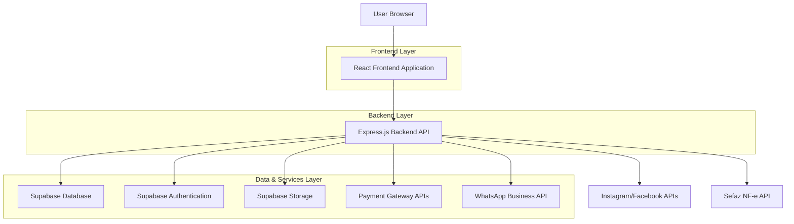
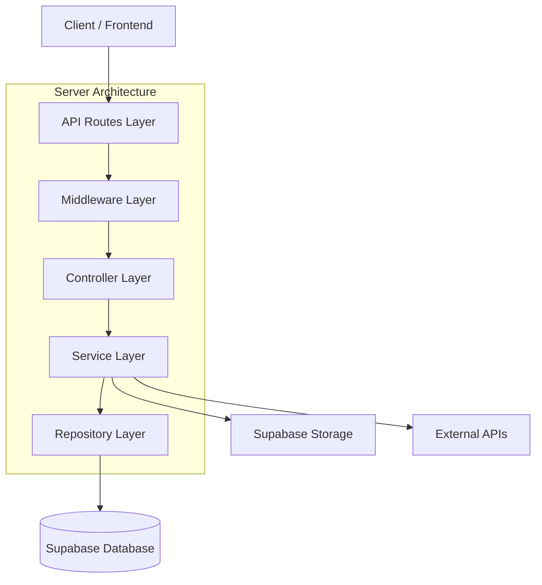
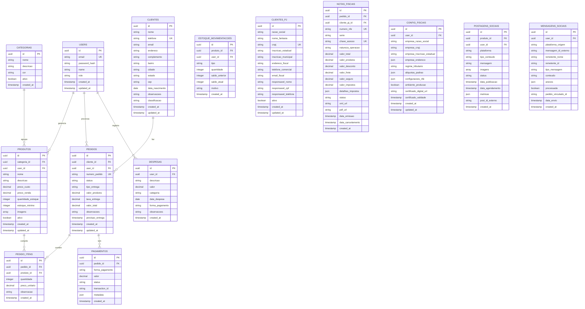

## 1. Arquitetura do Sistema



## 2. Stack Tecnológica

### Frontend
- **React 18** com TypeScript para desenvolvimento robusto e tipado
- **Vite** como build tool para desenvimento rápido e otimização de produção
- **Tailwind CSS 3** para estilização utilitária e responsiva
- **React Router 6** para navegação entre páginas
- **React Hook Form** para gerenciamento de formulários eficiente
- **React Query** para cache e sincronização de dados com backend
- **Chart.js** para visualização de gráficos e dashboards
- **React DnD** para funcionalidade drag and drop no Kanban
- **React Hot Toast** para notificações e feedback visual

### Backend
- **Node.js** com **Express.js 4** para API RESTful
- **TypeScript** para type safety em todo o backend
- **Supabase Client** para integração com serviços Supabase
- **Multer** para upload de imagens de produtos
- **PDFKit** para geração de recibos e relatórios
- **ExcelJS** para exportação de relatórios em Excel
- **Mercado Pago SDK** para integração de pagamentos
- **WhatsApp Business API** para integração de mensagens
- **Facebook Graph API** para integração com Instagram e Facebook
- **Sefaz API** para emissão de notas fiscais eletrônicas

### Banco de Dados e Serviços
- **Supabase** como Backend-as-a-Service principal
- **PostgreSQL** para banco de dados relacional
- **Supabase Auth** para autenticação e autorização
- **Supabase Storage** para armazenamento de imagens
- **Row Level Security (RLS)** para segurança de dados
- **Triggers PostgreSQL** para automações de negócio

## 3. Definições de Rotas

### Rotas do Frontend

| Rota | Componente | Descrição |
|------|------------|-----------|
| `/` | LoginPage | Página de autenticação do usuário |
| `/dashboard` | DashboardPage | Dashboard principal com métricas |
| `/produtos` | ProdutosListPage | Listagem de produtos |
| `/produtos/novo` | ProdutoFormPage | Cadastro de novo produto |
| `/produtos/:id` | ProdutoFormPage | Edição de produto existente |
| `/pedidos` | PedidosKanbanPage | Visualização Kanban de pedidos |
| `/pedidos/novo` | PedidoFormPage | Criação de novo pedido |
| `/pedidos/:id` | PedidoDetailPage | Detalhes do pedido |
| `/clientes` | ClientesListPage | Listagem de clientes |
| `/clientes/novo` | ClienteFormPage | Cadastro de novo cliente |
| `/clientes/:id` | ClienteDetailPage | Perfil completo do cliente |
| `/financeiro` | FinanceiroDashboardPage | Dashboard financeiro |
| `/financeiro/despesas` | DespesasPage | Controle de despesas |
| `/financeiro/metas` | MetasPage | Definição de metas |
| `/relatorios` | RelatoriosPage | Central de relatórios |
| `/vendas` | VendasInterfacePage | Interface de vendas rápidas |
| `/configuracoes` | ConfiguracoesPage | Configurações do sistema |
| `/redes-sociais` | RedesSociaisPage | Gerenciamento de redes sociais |
| `/redes-sociais/postar` | PostagemFormPage | Criar nova postagem |
| `/redes-sociais/metricas` | MetricasSociaisPage | Visualizar métricas de engajamento |
| `/nota-fiscal` | NotaFiscalPage | Dashboard de notas fiscais |
| `/nota-fiscal/emitir` | EmitirNotaPage | Emitir nova nota fiscal |
| `/nota-fiscal/notas` | NotasEmitidasPage | Listar notas emitidas |
| `/nota-fiscal/configuracoes` | ConfigFiscaisPage | Configurar dados fiscais |
| `/clientes-pj` | ClientesPJPage | Listar clientes pessoa jurídica |
| `/clientes-pj/novo` | ClientePJFormPage | Cadastrar novo cliente PJ |
| `/clientes-pj/:id` | ClientePJDetailPage | Detalhes do cliente PJ |

### Rotas da API Backend

| Método | Rota | Descrição |
|--------|------|-----------|
| GET | `/api/auth/me` | Verificar usuário autenticado |
| POST | `/api/auth/login` | Realizar login |
| POST | `/api/auth/logout` | Realizar logout |
| GET | `/api/produtos` | Listar produtos com paginação |
| POST | `/api/produtos` | Criar novo produto |
| PUT | `/api/produtos/:id` | Atualizar produto |
| DELETE | `/api/produtos/:id` | Excluir produto |
| POST | `/api/produtos/:id/estoque` | Atualizar estoque |
| GET | `/api/pedidos` | Listar pedidos com filtros |
| POST | `/api/pedidos` | Criar novo pedido |
| PUT | `/api/pedidos/:id` | Atualizar pedido |
| PUT | `/api/pedidos/:id/status` | Alterar status do pedido |
| GET | `/api/clientes` | Listar clientes |
| POST | `/api/clientes` | Criar novo cliente |
| PUT | `/api/clientes/:id` | Atualizar cliente |
| GET | `/api/clientes/:id/pedidos` | Histórico de pedidos do cliente |
| GET | `/api/financeiro/resumo` | Resumo financeiro do período |
| POST | `/api/financeiro/despesas` | Registrar despesa |
| GET | `/api/financeiro/fluxo-caixa` | Fluxo de caixa detalhado |
| GET | `/api/relatorios/vendas` | Relatório de vendas |
| GET | `/api/relatorios/produtos` | Relatório de produtos mais vendidos |
| GET | `/api/relatorios/clientes` | Relatório de análise de clientes |
| POST | `/api/vendas/checkout` | Processar venda e pagamento |
| POST | `/api/upload/imagem` | Upload de imagem de produto |
| GET | `/api/redes-sociais/contas` | Listar contas conectadas |
| POST | `/api/redes-sociais/conectar` | Conectar nova conta social |
| POST | `/api/redes-sociais/postar` | Publicar conteúdo nas redes sociais |
| GET | `/api/redes-sociais/metricas` | Obter métricas de engajamento |
| POST | `/api/redes-sociais/agendar` | Agendar postagem futura |
| GET | `/api/redes-sociais/dm-pedidos` | Buscar pedidos recebidos via DM |
| POST | `/api/redes-sociais/responder-dm` | Responder mensagem direta |
| GET | `/api/nota-fiscal/configuracoes` | Obter configurações fiscais |
| PUT | `/api/nota-fiscal/configuracoes` | Atualizar configurações fiscais |
| POST | `/api/nota-fiscal/emitir` | Emitir nota fiscal eletrônica |
| GET | `/api/nota-fiscal/notas` | Listar notas fiscais emitidas |
| GET | `/api/nota-fiscal/notas/:id` | Obter detalhes da nota fiscal |
| POST | `/api/nota-fiscal/cancelar/:id` | Cancelar nota fiscal |
| GET | `/api/nota-fiscal/relatorios` | Gerar relatórios fiscais |
| POST | `/api/clientes-pj` | Cadastrar cliente pessoa jurídica |
| PUT | `/api/clientes-pj/:id` | Atualizar cliente PJ |
| GET | `/api/clientes-pj` | Listar clientes PJ |
| GET | `/api/clientes-pj/:id` | Obter detalhes do cliente PJ |

## 4. Definições de API

### 4.1 Autenticação

#### Login de Usuário
```
POST /api/auth/login
```

Request:
| Parâmetro | Tipo | Obrigatório | Descrição |
|-----------|------|-------------|-----------|
| email | string | sim | Email do usuário |
| password | string | sim | Senha do usuário |

Response:
```json
{
  "user": {
    "id": "uuid",
    "email": "usuario@purposefood.com",
    "name": "Nome do Usuário",
    "role": "admin"
  },
  "session": {
    "access_token": "jwt_token",
    "refresh_token": "refresh_token",
    "expires_in": 3600
  }
}
```

### 4.5 Integração com Redes Sociais

#### Publicar Conteúdo
```
POST /api/redes-sociais/postar
```

Request:
| Parâmetro | Tipo | Obrigatório | Descrição |
|-----------|------|-------------|-----------|
| plataforma | string | sim | "instagram", "facebook" ou "ambos" |
| produto_id | string | não | ID do produto para postagem automática |
| mensagem | string | sim | Texto da postagem |
| imagens | array | não | URLs das imagens para postagem |
| agendado | boolean | não | Se true, usar data_agendamento |
| data_agendamento | string | não | Data/hora para agendamento (ISO 8601) |

Response:
```json
{
  "id": "social_post_uuid",
  "plataforma": "instagram",
  "status": "publicado",
  "data_publicacao": "2024-01-15T15:30:00Z",
  "engajamento_previsto": {
    "alcance": 1500,
    "curtidas": 85,
    "comentarios": 12
  }
}
```

#### Obter Métricas de Engajamento
```
GET /api/redes-sociais/metricas?periodo=7d&plataforma=instagram
```

Response:
```json
{
  "periodo": "7d",
  "plataforma": "instagram",
  "metricas": {
    "alcance": 12500,
    "impressoes": 18500,
    "curtidas": 642,
    "comentarios": 89,
    "compartilhamentos": 23,
    "salvamentos": 45
  },
  "top_posts": [
    {
      "id": "post_id",
      "imagem": "https://exemplo.com/imagem.jpg",
      "alcance": 2500,
      "curtidas": 156
    }
  ]
}
```

### 4.6 Emissão de Nota Fiscal

#### Configurar Dados Fiscais
```
PUT /api/nota-fiscal/configuracoes
```

Request:
| Parâmetro | Tipo | Obrigatório | Descrição |
|-----------|------|-------------|-----------|
| empresa_razao_social | string | sim | Razão social da empresa |
| empresa_cnpj | string | sim | CNPJ da empresa |
| empresa_inscricao_estadual | string | sim | Inscrição estadual |
| empresa_endereco | object | sim | Endereço completo da empresa |
| aliquotas_padrao | object | sim | Alíquotas padrão por tipo de produto |
| regime_tributario | string | sim | "simples", "lucro_real" ou "lucro_presumido" |

#### Emitir NF-e
```
POST /api/nota-fiscal/emitir
```

Request:
| Parâmetro | Tipo | Obrigatório | Descrição |
|-----------|------|-------------|-----------|
| pedido_id | string | sim | ID do pedido para emitir nota |
| cliente_pj_id | string | sim | ID do cliente pessoa jurídica |
| natureza_operacao | string | sim | Natureza da operação fiscal |
| forma_pagamento | string | sim | Forma de pagamento utilizada |
| observacoes_fiscais | string | não | Observações adicionais para a nota |

Response:
```json
{
  "id": "nota_fiscal_uuid",
  "numero": "00001",
  "serie": "1",
  "chave_acesso": "35240112345678901234567890123456789012345678",
  "data_emissao": "2024-01-15T15:30:00Z",
  "valor_total": 1250.00,
  "valor_impostos": {
    "icms": 150.00,
    "ipi": 0.00,
    "pis": 8.25,
    "cofins": 38.00
  },
  "status": "autorizada",
  "xml_url": "https://storage.purposefood.com/nfe/3524011234567890.xml",
  "pdf_url": "https://storage.purposefood.com/nfe/3524011234567890.pdf"
}
```

### 4.2 Gestão de Produtos

#### Criar Produto
```
POST /api/produtos
```

Request:
| Parâmetro | Tipo | Obrigatório | Descrição |
|-----------|------|-------------|-----------|
| nome | string | sim | Nome do produto |
| descricao | string | não | Descrição detalhada |
| categoria_id | string | sim | ID da categoria |
| preco_custo | number | sim | Preço de custo |
| preco_venda | number | sim | Preço de venda |
| quantidade_estoque | number | sim | Quantidade inicial |
| estoque_minimo | number | sim | Estoque mínimo |
| imagens | array | não | URLs das imagens |

Response:
```json
{
  "id": "uuid",
  "nome": "Coxinha de Frango",
  "descricao": "Coxinha artesanal de frango desfiado",
  "categoria": {
    "id": "uuid",
    "nome": "Salgados"
  },
  "preco_custo": 2.50,
  "preco_venda": 5.00,
  "margem_lucro": 50,
  "quantidade_estoque": 100,
  "estoque_minimo": 20,
  "status": "ativo",
  "created_at": "2024-01-15T10:30:00Z"
}
```

#### Atualizar Estoque
```
POST /api/produtos/:id/estoque
```

Request:
| Parâmetro | Tipo | Obrigatório | Descrição |
|-----------|------|-------------|-----------|
| tipo | string | sim | "entrada" ou "saida" |
| quantidade | number | sim | Quantidade a movimentar |
| motivo | string | sim | Motivo da movimentação |

### 4.3 Gestão de Pedidos

#### Criar Pedido
```
POST /api/pedidos
```

Request:
| Parâmetro | Tipo | Obrigatório | Descrição |
|-----------|------|-------------|-----------|
| cliente_id | string | sim | ID do cliente |
| tipo_entrega | string | sim | "delivery" ou "retirada" |
| endereco_entrega | object | sim | Dados do endereço |
| itens | array | sim | Array de produtos do pedido |
| forma_pagamento | string | sim | Forma de pagamento |
| observacoes | string | não | Observações gerais |

Cada item do pedido:
```json
{
  "produto_id": "uuid",
  "quantidade": 10,
  "preco_unitario": 5.00,
  "observacao": "Sem cebola"
}
```

Response:
```json
{
  "id": "uuid",
  "numero_pedido": "PED-2024-0001",
  "cliente": {
    "id": "uuid",
    "nome": "João Silva",
    "telefone": "(11) 98765-4321"
  },
  "status": "novo",
  "tipo_entrega": "delivery",
  "valor_total": 55.00,
  "taxa_entrega": 5.00,
  "previsao_entrega": "2024-01-15T12:00:00Z",
  "created_at": "2024-01-15T10:30:00Z"
}
```

### 4.4 Gestão Financeira

#### Registrar Despesa
```
POST /api/financeiro/despesas
```

Request:
| Parâmetro | Tipo | Obrigatório | Descrição |
|-----------|------|-------------|-----------|
| descricao | string | sim | Descrição da despesa |
| valor | number | sim | Valor da despesa |
| categoria | string | sim | Categoria da despesa |
| data | string | sim | Data da despesa |
| forma_pagamento | string | sim | Forma de pagamento |

Categorias: "insumos", "embalagens", "delivery", "marketing", "pessoal", "outros"

#### Resumo Financeiro
```
GET /api/financeiro/resumo?data_inicio=2024-01-01&data_fim=2024-01-31
```

Response:
```json
{
  "periodo": {
    "inicio": "2024-01-01",
    "fim": "2024-01-31"
  },
  "resumo": {
    "receitas": 15000.00,
    "despesas": 8000.00,
    "lucro_bruto": 7000.00,
    "lucro_liquido": 6500.00,
    "margem_lucro": 43.3
  },
  "vendas": {
    "total": 280,
    "ticket_medio": 53.57
  }
}
```

## 5. Arquitetura do Servidor



### 5.1 Camadas de Servidor

**API Routes Layer**: Define endpoints RESTful e validação de entrada
**Middleware Layer**: Autenticação, autorização, logging e tratamento de erros
**Controller Layer**: Orquestração de requisições e respostas HTTP
**Service Layer**: Lógica de negócios e regras empresariais
**Repository Layer**: Acesso e manipulação de dados no Supabase

## 6. Modelo de Dados

### 6.1 Diagrama Entidade-Relacionamento



### 6.2 Definições de Tabelas (DDL)

```sql
-- Tabela de usuários
CREATE TABLE users (
    id UUID PRIMARY KEY DEFAULT gen_random_uuid(),
    email VARCHAR(255) UNIQUE NOT NULL,
    password_hash VARCHAR(255) NOT NULL,
    name VARCHAR(255) NOT NULL,
    role VARCHAR(50) DEFAULT 'operator' CHECK (role IN ('admin', 'operator', 'viewer')),
    created_at TIMESTAMP WITH TIME ZONE DEFAULT NOW(),
    updated_at TIMESTAMP WITH TIME ZONE DEFAULT NOW()
);

-- Tabela de clientes
CREATE TABLE clientes (
    id UUID PRIMARY KEY DEFAULT gen_random_uuid(),
    nome VARCHAR(255) NOT NULL,
    telefone VARCHAR(20) UNIQUE NOT NULL,
    email VARCHAR(255),
    endereco TEXT,
    complemento VARCHAR(255),
    bairro VARCHAR(255),
    cidade VARCHAR(255),
    estado VARCHAR(2),
    cep VARCHAR(10),
    data_nascimento DATE,
    observacoes TEXT,
    classificacao VARCHAR(50) DEFAULT 'novo' CHECK (classificacao IN ('novo', 'regular', 'vip')),
    created_at TIMESTAMP WITH TIME ZONE DEFAULT NOW(),
    updated_at TIMESTAMP WITH TIME ZONE DEFAULT NOW()
);

-- Tabela de categorias
CREATE TABLE categorias (
    id UUID PRIMARY KEY DEFAULT gen_random_uuid(),
    nome VARCHAR(255) NOT NULL,
    descricao TEXT,
    cor VARCHAR(7) DEFAULT '#2196F3',
    ativo BOOLEAN DEFAULT true,
    created_at TIMESTAMP WITH TIME ZONE DEFAULT NOW()
);

-- Tabela de produtos
CREATE TABLE produtos (
    id UUID PRIMARY KEY DEFAULT gen_random_uuid(),
    categoria_id UUID REFERENCES categorias(id),
    user_id UUID REFERENCES users(id),
    nome VARCHAR(255) NOT NULL,
    descricao TEXT,
    preco_custo DECIMAL(10,2) NOT NULL,
    preco_venda DECIMAL(10,2) NOT NULL,
    quantidade_estoque INTEGER DEFAULT 0,
    estoque_minimo INTEGER DEFAULT 0,
    imagens TEXT[],
    ativo BOOLEAN DEFAULT true,
    created_at TIMESTAMP WITH TIME ZONE DEFAULT NOW(),
    updated_at TIMESTAMP WITH TIME ZONE DEFAULT NOW()
);

-- Tabela de pedidos
CREATE TABLE pedidos (
    id UUID PRIMARY KEY DEFAULT gen_random_uuid(),
    cliente_id UUID REFERENCES clientes(id),
    user_id UUID REFERENCES users(id),
    numero_pedido VARCHAR(20) UNIQUE NOT NULL,
    status VARCHAR(50) DEFAULT 'novo' CHECK (status IN ('novo', 'preparacao', 'pronto', 'entregue', 'cancelado')),
    tipo_entrega VARCHAR(50) CHECK (tipo_entrega IN ('delivery', 'retirada')),
    valor_produtos DECIMAL(10,2) NOT NULL,
    taxa_entrega DECIMAL(10,2) DEFAULT 0,
    valor_total DECIMAL(10,2) NOT NULL,
    observacoes TEXT,
    previsao_entrega TIMESTAMP,
    created_at TIMESTAMP WITH TIME ZONE DEFAULT NOW(),
    updated_at TIMESTAMP WITH TIME ZONE DEFAULT NOW()
);

-- Tabela de itens do pedido
CREATE TABLE pedido_itens (
    id UUID PRIMARY KEY DEFAULT gen_random_uuid(),
    pedido_id UUID REFERENCES pedidos(id) ON DELETE CASCADE,
    produto_id UUID REFERENCES produtos(id),
    quantidade INTEGER NOT NULL,
    preco_unitario DECIMAL(10,2) NOT NULL,
    observacao TEXT,
    created_at TIMESTAMP WITH TIME ZONE DEFAULT NOW()
);

-- Tabela de despesas
CREATE TABLE despesas (
    id UUID PRIMARY KEY DEFAULT gen_random_uuid(),
    user_id UUID REFERENCES users(id),
    descricao VARCHAR(255) NOT NULL,
    valor DECIMAL(10,2) NOT NULL,
    categoria VARCHAR(50) CHECK (categoria IN ('insumos', 'embalagens', 'delivery', 'marketing', 'pessoal', 'outros')),
    data_despesa DATE NOT NULL,
    forma_pagamento VARCHAR(50),
    observacoes TEXT,
    created_at TIMESTAMP WITH TIME ZONE DEFAULT NOW()
);

-- Tabela de movimentações de estoque
CREATE TABLE estoque_movimentacoes (
    id UUID PRIMARY KEY DEFAULT gen_random_uuid(),
    produto_id UUID REFERENCES produtos(id),
    user_id UUID REFERENCES users(id),
    tipo VARCHAR(10) CHECK (tipo IN ('entrada', 'saida')),
    quantidade INTEGER NOT NULL,
    saldo_anterior INTEGER NOT NULL,
    saldo_atual INTEGER NOT NULL,
    motivo TEXT,
    created_at TIMESTAMP WITH TIME ZONE DEFAULT NOW()
);

-- Tabela de clientes pessoa jurídica
CREATE TABLE clientes_pj (
    id UUID PRIMARY KEY DEFAULT gen_random_uuid(),
    razao_social VARCHAR(255) NOT NULL,
    nome_fantasia VARCHAR(255),
    cnpj VARCHAR(14) UNIQUE NOT NULL,
    inscricao_estadual VARCHAR(20) NOT NULL,
    inscricao_municipal VARCHAR(20),
    endereco_fiscal TEXT NOT NULL,
    telefone_comercial VARCHAR(20),
    email_fiscal VARCHAR(255),
    responsavel_nome VARCHAR(255) NOT NULL,
    responsavel_cpf VARCHAR(11) NOT NULL,
    responsavel_telefone VARCHAR(20),
    ativo BOOLEAN DEFAULT true,
    created_at TIMESTAMP WITH TIME ZONE DEFAULT NOW(),
    updated_at TIMESTAMP WITH TIME ZONE DEFAULT NOW()
);

-- Tabela de notas fiscais eletrônicas
CREATE TABLE notas_fiscais (
    id UUID PRIMARY KEY DEFAULT gen_random_uuid(),
    pedido_id UUID REFERENCES pedidos(id),
    cliente_pj_id UUID REFERENCES clientes_pj(id),
    numero_nfe VARCHAR(20) UNIQUE NOT NULL,
    serie VARCHAR(3) NOT NULL DEFAULT '1',
    chave_acesso VARCHAR(44) UNIQUE NOT NULL,
    natureza_operacao VARCHAR(100) NOT NULL,
    valor_total DECIMAL(10,2) NOT NULL,
    valor_produtos DECIMAL(10,2) NOT NULL,
    valor_desconto DECIMAL(10,2) DEFAULT 0,
    valor_frete DECIMAL(10,2) DEFAULT 0,
    valor_seguro DECIMAL(10,2) DEFAULT 0,
    valor_impostos DECIMAL(10,2) NOT NULL,
    detalhes_impostos JSONB NOT NULL,
    status VARCHAR(50) DEFAULT 'emitida' CHECK (status IN ('emitida', 'cancelada', 'denegada')),
    xml_url VARCHAR(500),
    pdf_url VARCHAR(500),
    data_emissao TIMESTAMP WITH TIME ZONE DEFAULT NOW(),
    data_cancelamento TIMESTAMP WITH TIME ZONE,
    created_at TIMESTAMP WITH TIME ZONE DEFAULT NOW()
);

-- Tabela de configurações fiscais
CREATE TABLE config_fiscais (
    id UUID PRIMARY KEY DEFAULT gen_random_uuid(),
    user_id UUID REFERENCES users(id),
    empresa_razao_social VARCHAR(255) NOT NULL,
    empresa_cnpj VARCHAR(14) NOT NULL,
    empresa_inscricao_estadual VARCHAR(20) NOT NULL,
    empresa_endereco JSONB NOT NULL,
    regime_tributario VARCHAR(50) NOT NULL CHECK (regime_tributario IN ('simples', 'lucro_real', 'lucro_presumido')),
    aliquotas_padrao JSONB NOT NULL,
    configuracoes_nfe JSONB,
    ambiente_producao BOOLEAN DEFAULT false,
    certificado_digital_url VARCHAR(500),
    certificado_validade TIMESTAMP,
    created_at TIMESTAMP WITH TIME ZONE DEFAULT NOW(),
    updated_at TIMESTAMP WITH TIME ZONE DEFAULT NOW()
);

-- Tabela de postagens sociais
CREATE TABLE postagens_sociais (
    id UUID PRIMARY KEY DEFAULT gen_random_uuid(),
    produto_id UUID REFERENCES produtos(id),
    user_id UUID REFERENCES users(id),
    plataforma VARCHAR(20) NOT NULL CHECK (plataforma IN ('instagram', 'facebook', 'whatsapp')),
    tipo_conteudo VARCHAR(50) NOT NULL DEFAULT 'produto',
    mensagem TEXT NOT NULL,
    imagens TEXT[],
    status VARCHAR(50) DEFAULT 'agendado' CHECK (status IN ('agendado', 'publicado', 'erro', 'cancelado')),
    data_publicacao TIMESTAMP WITH TIME ZONE,
    data_agendamento TIMESTAMP WITH TIME ZONE,
    metricas JSONB,
    post_id_externo VARCHAR(255),
    created_at TIMESTAMP WITH TIME ZONE DEFAULT NOW()
);

-- Tabela de mensagens sociais recebidas
CREATE TABLE mensagens_sociais (
    id UUID PRIMARY KEY DEFAULT gen_random_uuid(),
    user_id UUID REFERENCES users(id),
    plataforma_origem VARCHAR(20) NOT NULL CHECK (plataforma_origem IN ('instagram', 'facebook', 'whatsapp')),
    mensagem_id_externo VARCHAR(255) NOT NULL,
    remetente_nome VARCHAR(255) NOT NULL,
    remetente_id VARCHAR(255) NOT NULL,
    tipo_mensagem VARCHAR(50) NOT NULL,
    conteudo TEXT NOT NULL,
    anexos JSONB,
    processada BOOLEAN DEFAULT false,
    pedido_vinculado_id UUID REFERENCES pedidos(id),
    data_envio TIMESTAMP WITH TIME ZONE NOT NULL,
    created_at TIMESTAMP WITH TIME ZONE DEFAULT NOW()
);

-- Índices para performance
CREATE INDEX idx_clientes_telefone ON clientes(telefone);
CREATE INDEX idx_clientes_nome ON clientes(nome);
CREATE INDEX idx_clientes_pj_cnpj ON clientes_pj(cnpj);
CREATE INDEX idx_produtos_categoria ON produtos(categoria_id);
CREATE INDEX idx_produtos_ativo ON produtos(ativo);
CREATE INDEX idx_pedidos_status ON pedidos(status);
CREATE INDEX idx_pedidos_created_at ON pedidos(created_at);
CREATE INDEX idx_pedido_itens_pedido ON pedido_itens(pedido_id);
CREATE INDEX idx_estoque_movimentacoes_produto ON estoque_movimentacoes(produto_id);
CREATE INDEX idx_despesas_data ON despesas(data_despesa);
CREATE INDEX idx_notas_fiscais_pedido ON notas_fiscais(pedido_id);
CREATE INDEX idx_notas_fiscais_status ON notas_fiscais(status);
CREATE INDEX idx_notas_fiscais_data ON notas_fiscais(data_emissao);
CREATE INDEX idx_postagens_sociais_status ON postagens_sociais(status);
CREATE INDEX idx_postagens_sociais_data ON postagens_sociais(data_publicacao);
CREATE INDEX idx_mensagens_sociais_processada ON mensagens_sociais(processada);

-- Permissões básicas do Supabase
GRANT SELECT ON ALL TABLES TO anon;
GRANT ALL PRIVILEGES ON ALL TABLES TO authenticated;
GRANT USAGE ON SCHEMA public TO anon, authenticated;

-- Dados iniciais
INSERT INTO categorias (nome, descricao, cor) VALUES
('Salgados', 'Salgados fritos e assados artesanais', '#FF6B35'),
('Doces', 'Doces e sobremesas artesanais', '#4CAF50'),
('Bebidas', 'Bebidas e sucos naturais', '#2196F3'),
('Especiais', 'Produtos especiais e sazonais', '#9C27B0');

INSERT INTO users (email, password_hash, name, role) VALUES
('admin@purposefood.com', '$2b$10$YourHashedPasswordHere', 'Administrador', 'admin');
```

## 7. Configurações de Segurança

### 7.1 Row Level Security (RLS)

```sql
-- Políticas de segurança para produtos
ALTER TABLE produtos ENABLE ROW LEVEL SECURITY;

CREATE POLICY "Usuários podem ver produtos ativos" ON produtos
    FOR SELECT USING (ativo = true);

CREATE POLICY "Apenas admins podem gerenciar todos produtos" ON produtos
    FOR ALL USING (
        EXISTS (
            SELECT 1 FROM users 
            WHERE id = auth.uid() AND role = 'admin'
        )
    );

-- Políticas para pedidos
ALTER TABLE pedidos ENABLE ROW LEVEL SECURITY;

CREATE POLICY "Usuários podem ver seus próprios pedidos" ON pedidos
    FOR SELECT USING (user_id = auth.uid());

CREATE POLICY "Admins podem ver todos pedidos" ON pedidos
    FOR SELECT USING (
        EXISTS (
            SELECT 1 FROM users 
            WHERE id = auth.uid() AND role = 'admin'
        )
    );

-- Políticas para clientes PJ
ALTER TABLE clientes_pj ENABLE ROW LEVEL SECURITY;

CREATE POLICY "Usuários autenticados podem gerenciar clientes PJ" ON clientes_pj
    FOR ALL USING (
        EXISTS (
            SELECT 1 FROM users 
            WHERE id = auth.uid() AND role IN ('admin', 'operator')
        )
    );

-- Políticas para notas fiscais
ALTER TABLE notas_fiscais ENABLE ROW LEVEL SECURITY;

CREATE POLICY "Usuários podem ver notas de seus pedidos" ON notas_fiscais
    FOR SELECT USING (
        EXISTS (
            SELECT 1 FROM pedidos 
            WHERE pedidos.id = notas_fiscais.pedido_id 
            AND pedidos.user_id = auth.uid()
        )
    );

CREATE POLICY "Admins podem gerenciar todas notas" ON notas_fiscais
    FOR ALL USING (
        EXISTS (
            SELECT 1 FROM users 
            WHERE id = auth.uid() AND role = 'admin'
        )
    );

-- Políticas para configurações fiscais
ALTER TABLE config_fiscais ENABLE ROW LEVEL SECURITY;

CREATE POLICY "Apenas admins podem gerenciar configurações fiscais" ON config_fiscais
    FOR ALL USING (
        EXISTS (
            SELECT 1 FROM users 
            WHERE id = auth.uid() AND role = 'admin'
        )
    );

-- Políticas para postagens sociais
ALTER TABLE postagens_sociais ENABLE ROW LEVEL SECURITY;

CREATE POLICY "Usuários podem gerenciar suas postagens" ON postagens_sociais
    FOR ALL USING (user_id = auth.uid());

-- Políticas para mensagens sociais
ALTER TABLE mensagens_sociais ENABLE ROW LEVEL SECURITY;

CREATE POLICY "Usuários podem ver mensagens de sua conta" ON mensagens_sociais
    FOR SELECT USING (user_id = auth.uid());

CREATE POLICY "Admins podem gerenciar todas mensagens" ON mensagens_sociais
    FOR ALL USING (
        EXISTS (
            SELECT 1 FROM users 
            WHERE id = auth.uid() AND role = 'admin'
        )
    );
```

### 7.2 Configurações de CORS e Ambiente

```typescript
// Configurações de ambiente
interface Environment {
  SUPABASE_URL: string;
  SUPABASE_ANON_KEY: string;
  SUPABASE_SERVICE_KEY: string;
  MERCADO_PAGO_ACCESS_TOKEN: string;
  WHATSAPP_BUSINESS_TOKEN: string;
  JWT_SECRET: string;
  NODE_ENV: 'development' | 'production';
  PORT: number;
}

// Configurações CORS
const corsOptions = {
  origin: process.env.NODE_ENV === 'production' 
    ? ['https://purposefood.app', 'https://app.purposefood.com']
    : ['http://localhost:3000', 'http://localhost:5173'],
  credentials: true,
  methods: ['GET', 'POST', 'PUT', 'DELETE', 'OPTIONS'],
  allowedHeaders: ['Content-Type', 'Authorization', 'X-Requested-With']
};
```

## 8. Integrações Externas

### 8.1 Mercado Pago

```typescript
// Configuração do SDK
import mercadopago from 'mercadopago';

mercadopago.configure({
  access_token: process.env.MERCADO_PAGO_ACCESS_TOKEN,
  integrator_id: 'purpose_food_001'
});

// Configuração da API do Facebook/Instagram
const facebookConfig = {
  appId: process.env.FACEBOOK_APP_ID,
  appSecret: process.env.FACEBOOK_APP_SECRET,
  accessToken: process.env.FACEBOOK_ACCESS_TOKEN,
  instagramBusinessAccountId: process.env.INSTAGRAM_BUSINESS_ACCOUNT_ID
};

// Configuração da API da Sefaz para NF-e
const sefazConfig = {
  certificado: process.env.SEFAZ_CERTIFICADO_PATH,
  senha_certificado: process.env.SEFAZ_CERTIFICADO_SENHA,
  ambiente: process.env.SEFAZ_AMBIENTE || 'homologacao', // homologacao ou producao
  uf: process.env.SEFAZ_UF || 'SP',
  cnpj: process.env.SEFAZ_CNPJ
};

// Criação de preferência de pagamento
const createPaymentPreference = async (orderData: OrderData) => {
  const preference = {
    items: orderData.items.map(item => ({
      id: item.produto_id,
      title: item.nome,
      quantity: item.quantidade,
      currency_id: 'BRL',
      unit_price: item.preco_unitario
    })),
    payer: {
      name: orderData.cliente.nome,
      email: orderData.cliente.email,
      phone: {
        area_code: '11',
        number: orderData.cliente.telefone
      }
    },
    back_urls: {
      success: `${process.env.FRONTEND_URL}/pagamento/sucesso`,
      failure: `${process.env.FRONTEND_URL}/pagamento/erro`,
      pending: `${process.env.FRONTEND_URL}/pagamento/pendente`
    },
    auto_return: 'approved',
    notification_url: `${process.env.BACKEND_URL}/api/webhooks/mercado-pago`
  };
  
  return await mercadopago.preferences.create(preference);
};
```

### 8.2 WhatsApp Business API

```typescript
// Configuração da API do WhatsApp
const whatsappConfig = {
  phoneNumberId: process.env.WHATSAPP_PHONE_NUMBER_ID,
  accessToken: process.env.WHATSAPP_BUSINESS_TOKEN,
  version: 'v18.0'
};

// Envio de mensagem de confirmação de pedido
const sendOrderConfirmation = async (cliente: Cliente, pedido: Pedido) => {
  const message = {
    messaging_product: 'whatsapp',
    to: cliente.telefone,
    type: 'template',
    template: {
      name: 'order_confirmation',
      language: {
        code: 'pt_BR'
      },
      components: [
        {
          type: 'body',
          parameters: [
            { type: 'text', text: cliente.nome },
            { type: 'text', text: pedido.numero_pedido },
            { type: 'text', text: pedido.valor_total.toFixed(2) },
            { type: 'text', text: pedido.previsao_entrega }
          ]
        }
      ]
    }
  };
  
  return await sendWhatsAppMessage(message);
};

// Postagem automática no Instagram
const createInstagramPost = async (produto: Produto, mensagem: string) => {
  const mediaData = {
    image_url: produto.imagens[0],
    caption: `${mensagem}\n\n#${produto.categoria.nome.toLowerCase()} #artesanal #purposefood`,
    access_token: facebookConfig.accessToken
  };
  
  // Criar container de mídia
  const containerResponse = await fetch(
    `https://graph.facebook.com/v18.0/${facebookConfig.instagramBusinessAccountId}/media`,
    {
      method: 'POST',
      headers: { 'Content-Type': 'application/json' },
      body: JSON.stringify(mediaData)
    }
  );
  
  const container = await containerResponse.json();
  
  // Publicar o container
  const publishResponse = await fetch(
    `https://graph.facebook.com/v18.0/${facebookConfig.instagramBusinessAccountId}/media_publish`,
    {
      method: 'POST',
      headers: { 'Content-Type': 'application/json' },
      body: JSON.stringify({
        creation_id: container.id,
        access_token: facebookConfig.accessToken
      })
    }
  );
  
  return await publishResponse.json();
};

// Emissão de NF-e via integração com Sefaz
const emitirNFe = async (dadosNFe: DadosNFe) => {
  const xmlNFe = gerarXMLNFe(dadosNFe);
  
  const config = {
    method: 'POST',
    headers: {
      'Content-Type': 'application/xml',
      'Authorization': `Bearer ${sefazConfig.certificado}`
    },
    body: xmlNFe
  };
  
  // Enviar para API da Sefaz (exemplo simplificado)
  const response = await fetch(
    `https://nfe.${sefazConfig.uf}.gov.br/nfce/services/NFeAutorizacao4`,
    config
  );
  
  const resultado = await response.json();
  
  if (resultado.retorno.status === '100') {
    // Nota autorizada com sucesso
    return {
      status: 'autorizada',
      chave_acesso: resultado.retorno.chave_acesso,
      numero_protocolo: resultado.retorno.protocolo,
      xml: xmlNFe,
      pdf: await gerarPDFNFe(xmlNFe)
    };
  } else {
    throw new Error(`Erro na emissão: ${resultado.retorno.motivo}`);
  }
};
```

## 9. Deploy e Infraestrutura

### 9.1 Configuração de Deploy

O sistema é otimizado para deploy em plataformas serverless com mínima configuração:

**Frontend (Vercel/Netlify)**:
- Build automático com Vite
- Variáveis de ambiente configuradas via dashboard
- CDN global para assets estáticos
- Preview deployments para cada PR

**Backend (Railway/Render)**:
- Container Node.js com auto-scaling
- Variáveis de ambiente via dashboard
- Logs centralizados e monitoring
- Health checks automáticos

**Banco de Dados (Supabase)**:
- Managed PostgreSQL com backups automáticos
- Auto-scaling de recursos conforme necessário
- Dashboard administrativo integrado
- Webhooks para automações

### 9.2 Variáveis de Ambiente Necessárias

```bash
# Frontend (.env.production)
VITE_SUPABASE_URL=https://your-project.supabase.co
VITE_SUPABASE_ANON_KEY=your-anon-key
VITE_API_URL=https://api.purposefood.com

# Backend (.env.production)
SUPABASE_URL=https://your-project.supabase.co
SUPABASE_SERVICE_KEY=your-service-key
MERCADO_PAGO_ACCESS_TOKEN=your-mercado-pago-token
WHATSAPP_BUSINESS_TOKEN=your-whatsapp-token
JWT_SECRET=your-jwt-secret
NODE_ENV=production
PORT=3000

# Integrações Sociais
FACEBOOK_APP_ID=your-facebook-app-id
FACEBOOK_APP_SECRET=your-facebook-app-secret
FACEBOOK_ACCESS_TOKEN=your-facebook-access-token
INSTAGRAM_BUSINESS_ACCOUNT_ID=your-instagram-account-id

# Emissão de Nota Fiscal
SEFAZ_CERTIFICADO_PATH=/path/to/certificado.pfx
SEFAZ_CERTIFICADO_SENHA=your-cert-password
SEFAZ_AMBIENTE=producao # ou homologacao
SEFAZ_UF=SP
SEFAZ_CNPJ=your-company-cnpj
```

Esta arquitetura garante escalabilidade, segurança e facilidade de manutenção, permitindo que o sistema cresça conforme a demanda do negócio.